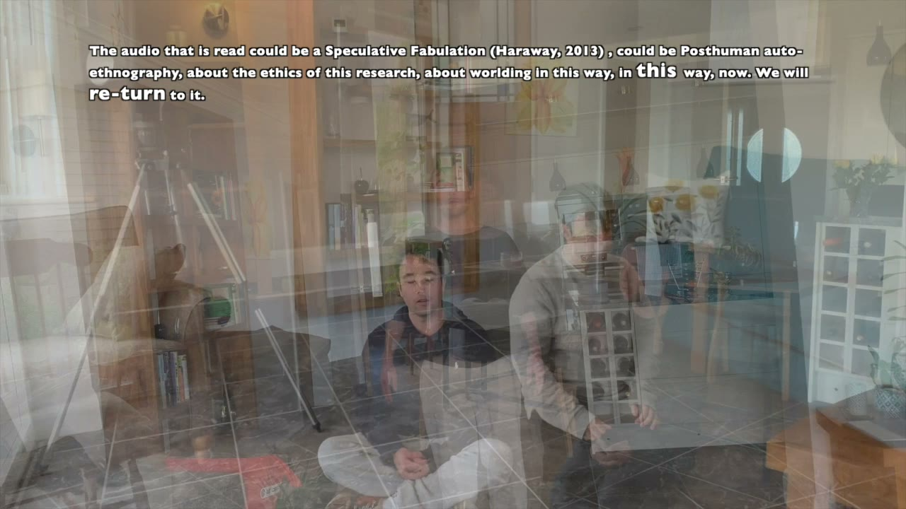

## Nursing a Radical Imagination

Examining the historical context of healthcare whilst focusing on building a more just, equitable world, this book proposes a radical imagination for nursing and presents possibilities for speculative futures embracing queer, feminist, posthuman, and abolitionist frames. Edited by Jess Dillard-Wright, Jane Hopkins-Walsh and Brandon Blaine Brown (Routledge, 2022). In the *Journal of Advanced Nursing*, Mick McKeown urged nurses to "read and act on the text". [The book →](https://doi.org/10.4324/9781003245957) · [McKeown's editorial →](https://doi.org/10.1111/jan.15530)

## Nursing Inquiry: the Critical Posthumanism special issue

What began as a call for contributions became *Nursing Inquiry* 31(1) (2024) — a special issue anchored by four of our papers: [Notes on [post]human nursing](https://doi.org/10.1111/nin.12562), [We a*ll c*are, ALL the time](https://doi.org/10.1111/nin.12572) (a recorded conversation with posthuman scholars Goda Klumbytė and Kay Sidebottom), [The Vitruvian nurse and burnout](https://doi.org/10.1111/nin.12538), and Annie-Claude and Patrick's [Thinking through critical posthumanism](https://doi.org/10.1111/nin.12606). In her editorial for the issue, editor-in-chief Sally Thorne credited the collective with "a key role" in urging nursing towards posthumanist perspectives. [The issue →](https://onlinelibrary.wiley.com/toc/14401800/2024/31/1)

## Witness: The Perils of a Politics of Neutrality

Jess guest-edited this themed issue of *Witness: The Canadian Journal of Critical Nursing Discourse* (7(2), December 2025) — on the politics the discipline pretends not to have. It carries her editorial and her article [Our Silence Cannot Protect Us](https://doi.org/10.25071/2291-5796.195), alongside Jane and Annie-Claude's [Imaginative Archives for a More Radical Nursing Future](https://doi.org/10.25071/2291-5796.187), which introduces the collective in its own words. [The issue →](https://witness.journals.yorku.ca/index.php/default/issue/archive)

## Constantly Becoming With

Video wonderings by [Kieran Sheehan](../people/kieran/), the collective's movement artist. 2022, 25 minutes. The full film has been preserved from the old site and will stream here again soon.

## Making Care Perceptible

Nursing / intuitive movement / posthuman care: Jamie, Eva and Kieran, with posthuman legal theorist Emily Jones, wrote the chapter "Making Care Perceptible" for *Posthuman Convergences: Transdisciplinary Methods and Practices*, edited by Goda Klumbytė, Emily Jones and Rosi Braidotti (Edinburgh University Press, 2025) — the art strand of the compost, in print. [The book →](https://edinburghuniversitypress.com/book-posthuman-convergences.html)

## The Imperative

The imperative for critical posthuman research in nursing — our shared statement of why compost, why now. [Read →](../imperative/)

## Solidarity is a Nursing Intervention

Video testimonies from the collective. [Watch →](../solidarity/)

## The Eco-Squisite Corpse

Led by Peter Hopkins and Jane Hopkins-Walsh: the anchor piece of the Nurses and Midwives Art Exchange, exhibited in "Archive of Feelings" at The Big Anxiety festival, RMIT Melbourne, 2022. [The exchange →](https://www.thebiganxiety.org/events/nurses-and-midwives-art-exchange/)

## Drift Journal

A living, traveling work of art-in-progress, art-as-praxis. Journal constructed by Jane Hopkins-Walsh and released into the world in February 2021.

## Affirmative Music

Our ever expanding shared playlist that creates shared understanding and brings joy. [Listen on Spotify →](https://open.spotify.com/playlist/4zFzgIm8cQBHr2YVZi2I23)
